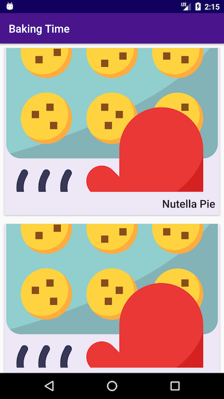
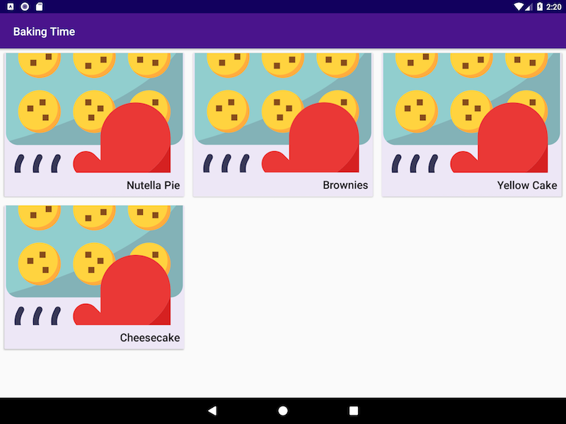
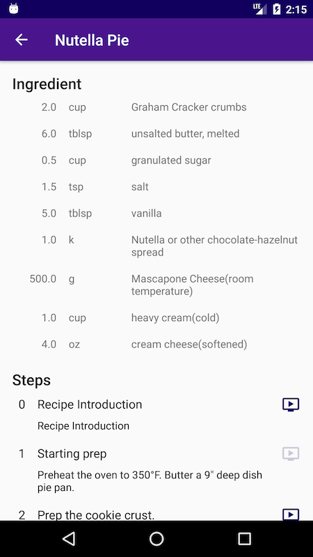
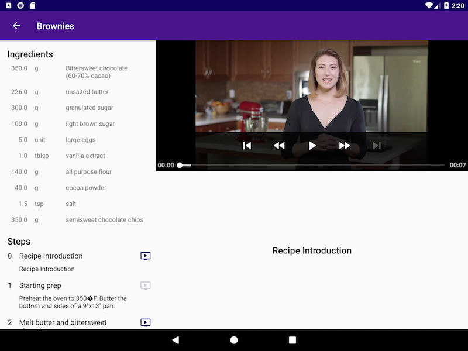
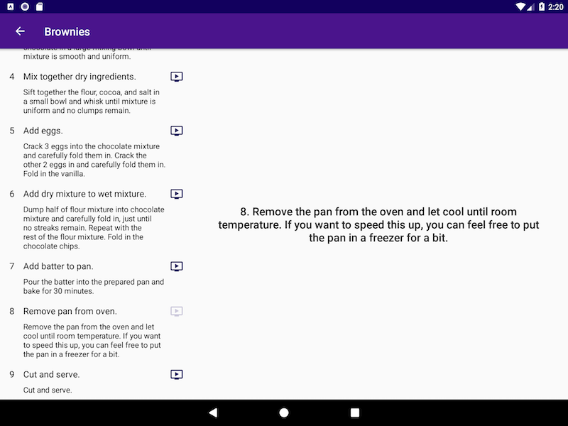
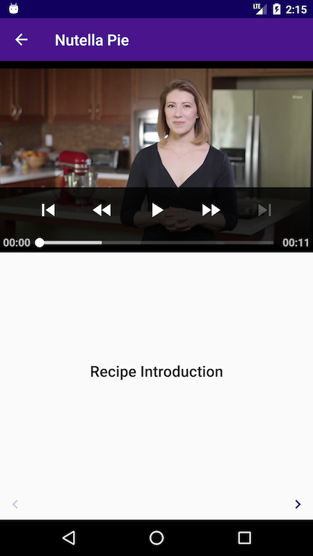

# Baking App 
Recipe app created for Udacity's Android Nanodegree Course using ExoPlayer and Fragments. 

Main requirement is for a different more relevant layout to be displayed depending on whether the user is viewing on a tablet or a phone; in portrait or landscape mode.

*MainActivity*

   
   

    
*RecipeActivity*

   
   
   
   
*VideoActivity*

   
